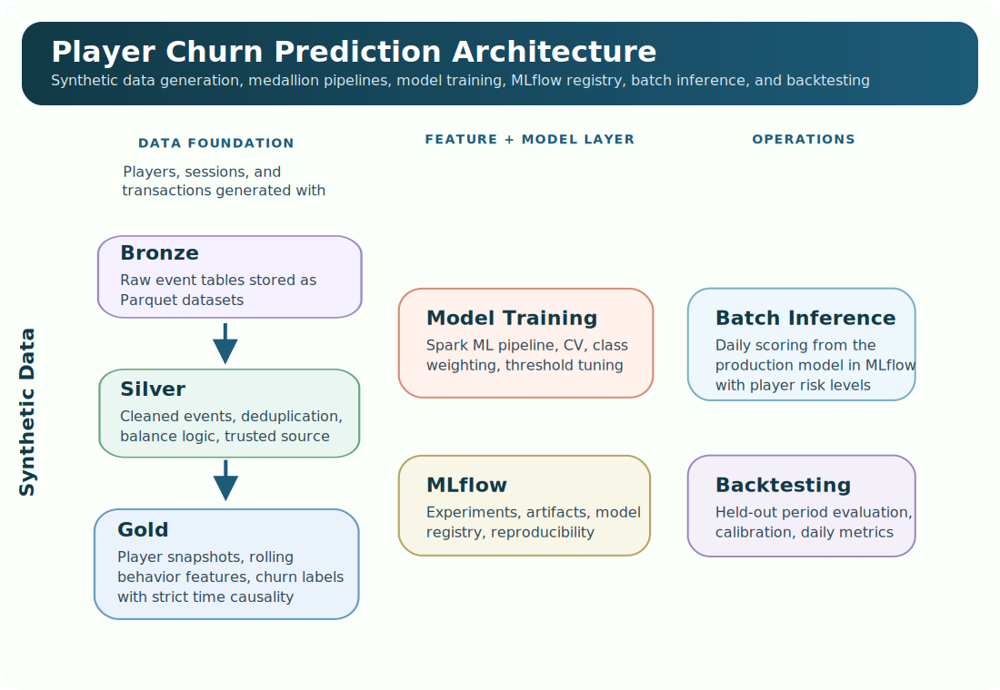
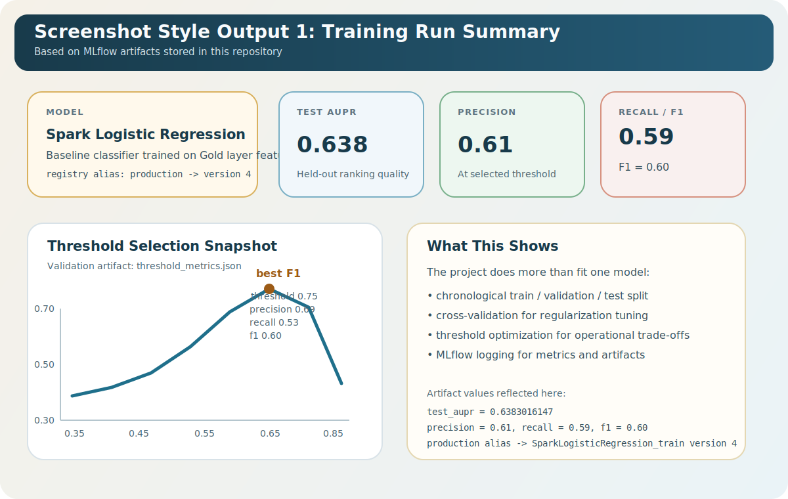
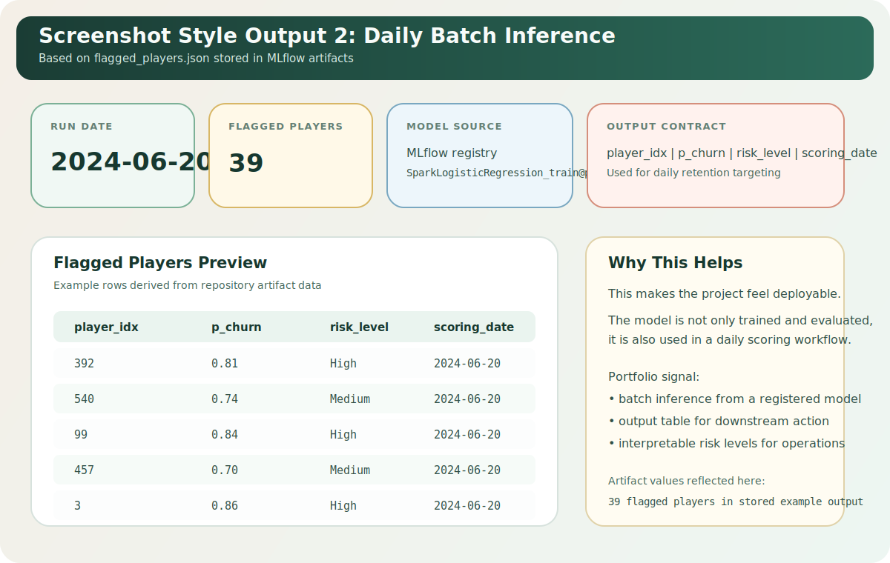
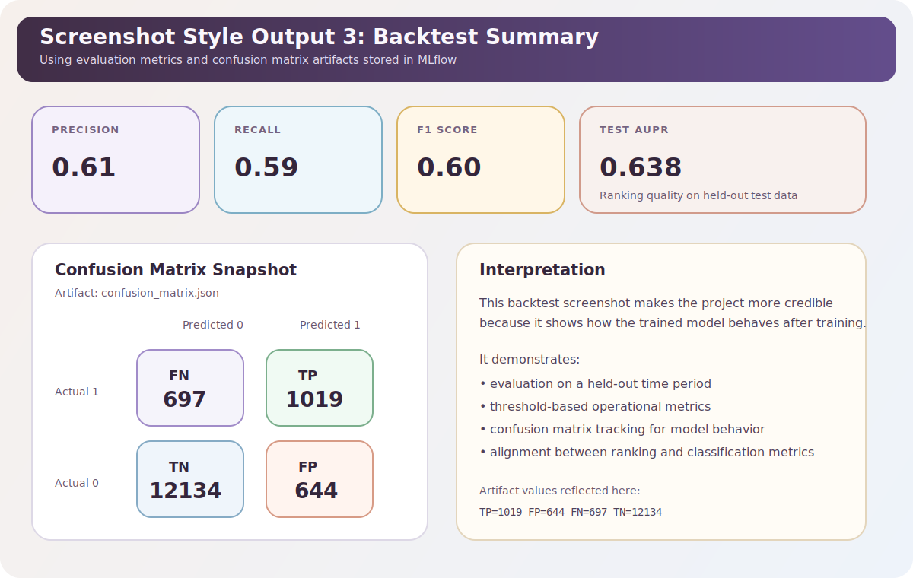

# Player Churn Prediction with PySpark and MLflow

An end-to-end machine learning project that simulates a real gaming analytics workflow: synthetic data generation, medallion-style data pipelines, churn feature engineering, model training, experiment tracking, batch inference, and backtesting.

The goal is to predict whether a player will complete a 7-day inactivity period within the next 7 days, using only information available up to the scoring date.

## Business Framing

Prediction unit:

`(player, reference_date) -> probability of churn completion in (t, t+7]`

This means the system produces daily risk scores, not one static score per player. That makes it closer to how churn models are used in production CRM and retention workflows.

Example output:

| player_idx | reference_date | p_churn | risk_level |
| ---------- | -------------- | ------- | ---------- |
| 1023 | 2024-06-20 | 0.81 | High |
| 587 | 2024-06-20 | 0.47 | Low |

## What The Project Covers

- Synthetic player, session, and transaction generation
- Bronze -> Silver -> Gold data architecture
- Time-aware feature engineering with Spark window functions
- Churn label construction with strict temporal causality
- Logistic Regression baseline built in Spark ML
- Hyperparameter tuning and threshold selection
- MLflow logging, model registration, and experiment metadata
- Daily batch inference from registered production model
- Backtesting on held-out time periods

## Architecture



1. **Clone the repository**
   ```bash
   git clone https://github.com/JKaraman93/bet.git
   cd bet
   ```

```text
src/bet/
├── ingestion/     # Synthetic data generation and player behavior simulation
├── pipelines/     # Bronze, Silver, Gold dataset creation
├── models/        # Training, inference, and inference feature prep
├── evaluation/    # Backtesting and performance analysis
├── utils/         # Spark session, config, constants, helpers
└── schemas/       # Data schema notes
```
 
## Tech Stack

- Python
- PySpark
- Spark SQL
- Spark ML
- MLflow
- pandas
- scikit-learn
- matplotlib
- Parquet

## Data Architecture

### Bronze

Raw synthetic data generated for:

- players
- sessions
- transactions

### Silver

Cleaned and standardized event tables used as the trusted source for downstream feature computation.

Key work in this layer:

- deduplication
- date consistency checks
- balance logic validation
- unified money-event construction

### Gold

ML-ready tables:

- `player_snapshot`: mostly static player attributes
- `player_behavior`: rolling 7-day and 30-day behavioral features
- `labels`: future churn target aligned to each player-date

## Feature Engineering

The feature layer was designed around a few production-style principles:

- strict time causality: features use only data up to `reference_date`
- rolling windows: behavior summarized over recent 7-day and 30-day periods
- zero-activity preservation: inactive players remain in the dataset
- training-serving consistency: inference recomputes features from source data instead of trusting precomputed historical outputs

Examples of engineered features:

- session counts over 7d and 30d
- average session duration
- average bet amount
- net game result
- deposit and withdrawal activity
- failed withdrawals
- withdrawal ratio
- historical balance snapshots

## Modeling Approach

Baseline model:

- Logistic Regression in Spark ML

Preprocessing pipeline:

- StringIndexer
- OneHotEncoder
- VectorAssembler
- StandardScaler
- LogisticRegression

Validation strategy:

- chronological train / validation / test split
- 3-fold cross-validation on the training period
- Area Under Precision-Recall as the primary ranking metric
- threshold tuning based on validation performance

## MLflow Usage

The training pipeline logs:

- hyperparameters
- evaluation metrics
- threshold choices
- feature importance output
- precision-recall curve
- model artifacts
- environment metadata
- git metadata when available

The project also uses the MLflow model registry to load the production model during inference and backtesting.

## Inference Design

The inference flow is intentionally close to a deployment scenario:

1. recompute numeric features for a scoring date from source data
2. load the production model from MLflow
3. generate churn probabilities
4. convert probabilities into risk levels
5. log prediction outputs and metadata

This project uses batch scoring rather than online inference, which is realistic for daily retention targeting.

## Backtesting

Backtesting evaluates the registered production model on a held-out time period and logs:

- daily precision, recall, and F1
- flagged-player volumes
- churn concentration by risk bucket
- calibration summaries

This helps connect model quality to how the scoring system would behave operationally.

## Quick Start

### 1. Clone the repository

```bash
git clone <repository-url>
cd bet
```

### 2. Create and activate a virtual environment

```bash
python -m venv venv
source venv/bin/activate
```

### 3. Install the package

```bash
pip install -e .
```

### 4. Generate the datasets

```bash
python src/bet/pipelines/create_bronze_dataset.py
python src/bet/pipelines/create_silver_dataset.py
python src/bet/pipelines/create_gold_dataset.py
```

### 5. Train the model

```bash
python src/bet/models/logistic_regression.py
```

### 6. Run batch inference for one day

```bash
python src/bet/models/inference.py 2024-06-20
```

### 7. Run backtesting

```bash
python src/bet/evaluation/backtest.py
```

## Run With Docker

This project now includes a minimal Docker setup for learning and reproducible local execution.

### Build the image

```bash
docker build -t bet-project .
```

### Run the default command

The image now starts by showing the available commands:

```bash
docker run --rm -v "$(pwd):/app" bet-project
```

### Run a pipeline step

Use the built-in command wrapper:

```bash
docker run --rm -v "$(pwd):/app" bet-project bronze
docker run --rm -v "$(pwd):/app" bet-project silver
docker run --rm -v "$(pwd):/app" bet-project gold
docker run --rm -v "$(pwd):/app" bet-project train
docker run --rm -v "$(pwd):/app" bet-project backtest
docker run --rm -v "$(pwd):/app" bet-project inference 2024-06-20
```

### Recommended execution order

Required workflow:

1. Generate Bronze data
2. Generate Silver data
3. Generate Gold data
4. Train the model
5. Run inference for a scoring date

Optional evaluation step:

- Run backtesting after training to evaluate the selected model on held-out data

### Important MLflow note

After training, you must manually assign your desired registered model version the MLflow alias `production` before running inference.

This is required because both [src/bet/models/inference.py](/home/dimitris/Documents/bet/src/bet/models/inference.py) and [src/bet/evaluation/backtest.py](/home/dimitris/Documents/bet/src/bet/evaluation/backtest.py) load the model using:

```text
models:/SparkLogisticRegression_train@production
```

## Example Outputs

These screenshot-style visuals are based on artifacts already stored in the repository and help show the project as a complete workflow rather than only code.

### Training Run Summary



### Daily Inference Output



### Backtest Summary




## Possible Next Improvements

If I wanted to extend the project later, the next logical steps would be:

- add lightweight unit tests for feature and label logic
- compare the baseline against tree-based models
